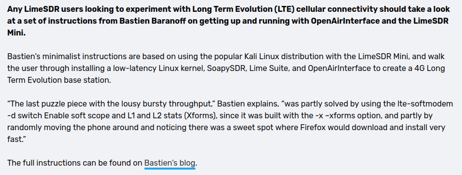

---
# Resume
---

---
> "The quieter you become the most you are able to hear"
---

---
## Experience  

### Developer  

  

### Junior Researcher 
  
  

### CyberSecurity Analyst  
  
    
  
### Former  
  
<a href="https://univ-perp.fr">  
  
### Former (Education Nationale)  
  
<a href=https://www.education.gouv.fr/">  

---

---

## Quoted :

Second Time :  

First TIme :  

---

---

## Stuff

---|---
test|test

---
